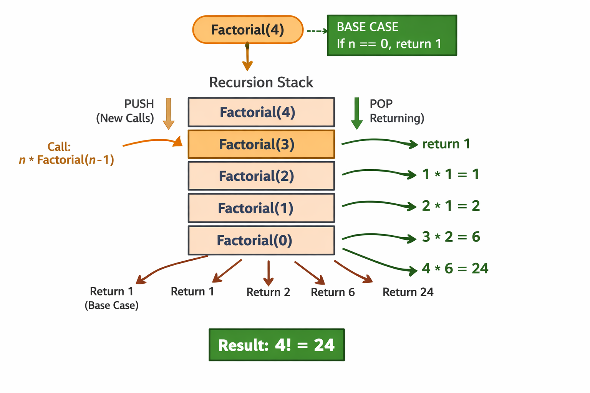

# 🔑 Core Concepts

- **Recursion** = A function calling itself until a base case is met.

- **Base Case** = condition that stops recursion.

- **Recursive Case** = function calls itself with smaller input.

- **Think of recursion as divide → solve → combine.** 

*********************************************************************************

# Interview-Style Recursion Problems

- **Factorial** 
- **Fibonacci** 
- **Reverse String** 
- **Palindrome Check** 
- **Binary Tree Traversals** 
- **Tower of Hanoi** 
- **Generate Subsets** 
- **N-Queens Problem** 
 
## Question 1
**Why recursion over iteration?**

**Answer:**  
Recursion is cleaner for hierarchical problems (trees, graphs). Iteration may be faster but harder to express.

## Question 2
**What’s the risk of recursion?**

**Answer:**  
Stack overflow if base case is missing or input is huge. That’s why interviewers ask about tail recursion and memoization.

## Question 3
**Difference between recursion and dynamic programming?**

**Answer:**  
DP = recursion + memoization. Recursion explores subproblems; DP stores results to avoid recomputation.

## Question 4
**Can recursion always be replaced with iteration?**

**Answer:**  
Yes, but recursion is natural for problems like DFS, tree traversal. Iteration may require explicit stack/queue.

## Question 5
**What is tail recursion?**

**Answer:**  
When the recursive call is the last operation in the function. Some compilers optimize it to avoid stack growth.

## Question 5
**Space vs Time Tradeoff?**

**Answer:**  
HashMap lookup is O(1) time but uses O(n) space. Sometimes we sacrifice memory for speed.

## Question 6
**How does recursion work internally?**

**Answer:**  
Each call creates a stack frame. Base case stops recursion, then stack unwinds returning results.

